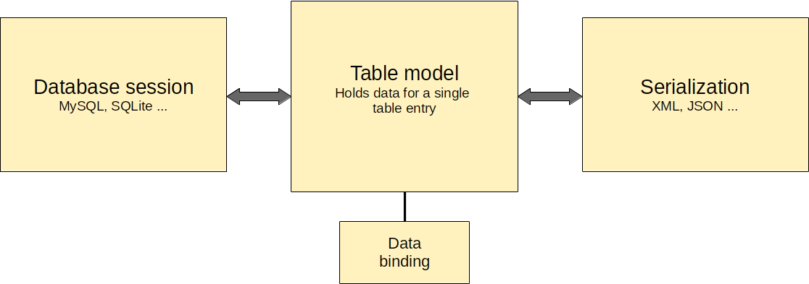

# dbm

[](https://app.travis-ci.com/ipeperko/dbm)



Simple database table models with serialization support written in C++. 

- currently supported databases: SQLite, MySQL
- requires C++17
- build-in lightweight xml serializer
- MIT licence

Note : this library is under development and subject to change. Contributions are welcome.

### Example

Writing and reading data from database into model

```c++
using namespace dbm;

try 
{
    sqlite_session session("hello_dbm.sqlite");
    session.open();
    
    std::string name = "Rambo";
    double score = 42;

    auto name_validator = [](const std::string& s) {
        return !s.is_empty();
    };
    
    model m("test_table",
            {
                { key("id"),    local<int>(1),    primary(true),    not_null(true),    auto_incremenet(true)   },
                { key("name"),  binding(name, name_validator)                   },
                { key("score"), binding(score)                                  }
            });
            
    // insert or update existing record
    m >> session; 
    
    // read database and insert data into model
    session >> m;
}
catch (std::exception& e)
{
    std::cerr << "exception: " << e.what() << "\n";
}
```

### Serializers

##### Build-in XML serializer
```c++
xml_serilizer xml;

// read data from database and serialize
session >> m >> xml;
std::cout << xml.object().to_string(4) << "\n";  

xml.set("name", "Terminator");
xml.set("score", 43);

// deserialize data and write Terminator 43 to database
xml >> m >> session;
```

Note that build-in xml serializer is not fully compatible with the standard.
But if you are ok with lightweight version without comments, namespaces, schemas it works well.

##### Writing custom serializers
See example [nlohmann json serializer](https://github.com/ipeperko/dbm/blob/master/include/nlohmann_json_serializer.hpp)  

See also [nlohmann json](https://github.com/nlohmann/json) project.

### Models

##### Accessing and modifying model items

```c++
model m;

// set table name
m.set_table_name("my_table");

// adding items
m.emplace_back();
m.emplace_back(key("id"));
m.emplace_back( /* add parameters in any order */  
        key("name"), tag("Name"), taggable(true), 
        direction::bidirectional, primary(true), required(false),
        nut_null(false), auto_increment(false) 
        local<int>()); 

// accessing items through key name 
auto& item3 = m.at("name");     // same as m.at(key("id"))

// accessing items from items vector
auto& item1 = m.items().at(0);
auto& item2 = m.items()[1]; 

// access through iterators
auto it = m.find("name");
auto itb = m.begin();           // same as m.items().begin() 
auto itb = m.end();             // same as m.items().end() 

// remove item
m.erase("name"); // same as m.erase(key("name"))
```

##### Model item parameters overview

| Type           | Default       | Description                                                                                                                                                         |
|----------------|---------------|---------------------------------------------------------------------------------------------------------------------------------------------------------------------|
| key            |               | Database column name                                                                                                                                                |
| tag            |               | Optional tag for serialization. If not defined it will be serialized with same name as 'key'.                                                                       |
| primary        | false         | Field primary key constraint.                                                                                                                                       |
| taggable       | true          | Determines if Field will be serialized.                                                                                                                             |
| required       | false         | Determines if value should be defined when writing to db or serializing. Otherwise exception is thrown.                                                             |
| direction      | bidirectional | Field configuration for database write/read (bidirectional, read_only, write_only)                                                                                  |
| not_null       | false         | Field not null constraint (only relevant for table creation - has nothing to do with container state null).                                                         |
| defaultc       | std::nullopt  | Field default constraint (only relevant for table creation). Possible values are std::nullopt (no default constraint), nullptr (default NULL), any valid expression |
| auto_increment | false         | Field auto increment feature (only relevant for table creation).                                                                                                    |
| create         | true          | Determines if field will be created (only relevant for table creation).                                                                                             |
| local          |               | Value container with local storage of any supported type.                                                                                                           |
| binding        |               | Value container with binding.                                                                                                                                       |
| timestamp      |               | Special container with unix time to timestamp conversion                                                                                                            |

#### Value container

Library supports containers with local storage and binding containers.

```c++
std::string name;
m.item("name").set(local<std::string>());   // replace container with new local storage
m.item("name").set(binding(name));          // replace with new binding container
```

##### Supported types

- bool
- int16_t
- int32_t
- int64_t
- uint16_t
- uint32_t
- uint64_t
- double
- std::string
- timestamp (can hold or bind time_t and converts it to/from sql timestamp data type - see timestamp section)

##### Binding enums

Binding enums is not directly supported. 
One solution is to use c style cast with std::underlying_type_t.

```c++
enum class MyEnum : int { one=1, two, three };
MyEnum em;

auto cont = binding((std::underlying_type_t<MyEnum>&) (em));
cont->set(2); // or
cont->set(static_cast<std::underlying_type_t<MyEnum>>(MyEnum::two));
```

##### Parameters 'null' and 'defined'

Parameter 'defined' determines if value has been set. If false it won't be written to db or serializer.

Parameter 'null' determines if value is null.

| Storage type             | null            | defined     |
|--------------------------|-----------------|-------------|
| Local storage            | null            | not defined |
| Local storage with value | not null        | defined     |
| Binding                  | not null        | defined     |
| Value set success        | null / not null | defined     |
| Value set failed         | null            | not defined |
| From string succeeded    | not null        | defined     |
| From string failed       | null            | not defined |

```c++
local<int>();                               // null, not defined
local<int>(init_null::null);                // null, defined
local<int>(1);                              // not null, defined
binding<int>(my_int);                       // not null, defined
binding<int>(my_int, nullptr, init_null::null, init_defined::not_defined); 
                                            // null, not defined (arguments : reference, validator, null, defined)
local<int>()->set_null(false);              // not null
local<int>()->set_defined(true);            // defined
```

##### Validators

```c++
local<int>( [](int val) { return val > 0; } );
local<int>(1, [](int val) { return val > 0; } );    // with default value

std::string name;
auto validate_string = [](const std::string& s) { return !s.empty(); };
binding(name, validate_string );
```

##### Multiple rows result set

Alternatively you can retrieve data from database and pass separate rows to model. 

```c++
stetement stm;
stm << "SELECT * FROM test_table WHERE id<" << 100;
sql_rows rows = session.select(stm);
for (const sql_row& row : rows) {
    m << row;         // import data to model
}
```

Note that sql_rows do not store values. Field values are pointers to session internal result set.
If you want to store data for further work use sql_rows_dump.

```c++
sql_rows_dump data = rows;          // store data
sql_rows rows2 = data.restore();    // restore data
```

#### Prepared statements

Library supports prepared statements. When prepared_stmt object  

Write example:
```c++
int age = 42;
auto weight = dbm::local(66.6);
prepared_stmt stmt ("INSERT INTO person (name, age, weight) VALUES(?, ?, ?)",
                         dbm::local<std::string>("Alien"),      // internal local container
                         dbm::binding(age),                     // internal binding container
                         weight.get());                         // pointer to external container
 
// first insert
stmt >> session;        // writes query, same as session.query(stmt)
                        // prepared statement handle created
 
// second insert 
weight->set(77.7);
stmt >> session;       // prepared statement handle reused
```

Read example:
```c++
prepared_stmt stmt ("SELECT * FROM person",
                    local<int>(),               
                    local<std::string>(),
                    local<int>(),
                    local<double>());   // containers only determine data type

auto res = session.select(stmt);        // returns vector of container unique pointers
```

##### Transactions

Example:

```c++
{
    session::transaction tr(*db);   
    db.query("....")
    tr.commit();        // transaction committed, data written to the database
}

{
    session::transaction tr(*db);   
    db.query("....")
    // transaction rolled backed as we didn't commit, all data erased
    // transaction can be also manually rolled back:
    // tr.rollback();
}
```

##### Create and drop table

Basic usage:

```c++
m.create_table(session);                // creates table if not exists
m.drop_table(session);                  // drops table if exists
```

Table field data types are created based on container type and constraints (e.g. not null, auto increment, defaultc etc).

| Container type | MySQL             | SQLite    |
|----------------|-------------------|-----------|
| bool           | TINYINT           | INTEGER   |
| int16_t        | SHORTINT          | INTEGER   |
| int32_t        | INT               | INTEGER   |
| int64_t        | BIGINT            | INTEGER   |
| uint16_t       | SHORTINT UNSIGNED | INTEGER   |
| uint32_t       | INT UNSIGNED      | INTEGER   |
| uint64_t       | BIGINT UNSIGNED   | INTEGER   |
| double         | DOUBLE            | REAL      |
| std::string    | TEXT              | TEXT      |
| timestamp *    | TIMESTAMP         | TIMESTAMP |

(*) See timestamp section

If custom_data_type is specified any other constraints will be ignored (e.g. not null, auto increment etc). 

```c++
model_item(key("mytext"), local<std::string>(), custom_data_type("VARCHAR(45) NOT NULL DEFAULT ''"));
```

Table options can also be specified:

```c++
m.set_table_options("ENGINE=MEMORY");   // set table options (engine, collations etc)
```

##### Timestamp

If time is stored as integer simply create a container of type time_t.

```c++
time_t my_time;
m.emplace_back( key("time"), binding(my_time) ); // Add item to model 
``` 

Another option is to create a string container and dela with textual representation of time.

```c++
std::string str_time;
m.emplace_back( key("time"), binding(str_time), custom_data_type("TIMESTAMP NOT NULL DEFAULT CURRENT_TIMESTAMP") );
```

Converting unix time to timestamp is also possible. In this case model create member function will create 
field of type timestamp.  

```c++
time_t my_time;
m.emplace_back( key("time"), timestamp(my_time), not_null(true), defaultc("CURRENT_TIMESTAMP") );
``` 

timestamp is a special container which can hold time_t value internally or has a reference to an external variable.

```c++
time_t my_time;
timestamp(1234);    // Internal storage
timestanp(my_time); // Holds reference to my_time variable 
``` 

### Thread safety

dbm classes are not thread safe and should not be used concurrently.
For multithreaded applications pool can be used ([see instructions below](#Pool)).
One solution is also to use separate model and session objects for each thread.

### Pool

Example:

```c++
pool p
p.set_max_connections(10);
p.set_acquire_timeout(std::chrono::seconds(5));
p.set_heartbeat_interval(std::chrono::milliseconds(5000));
p.set_heartbeat_query("SELECT 1");
p.set_session_initializer([] {
    auto conn = std::make_shared<dbm::mysql_session>();
    conn.init("localhost", "username", "password", 3306, "dbname");
    conn->open();
    return conn;
});

auto conn1 = p.acquire();       // creates a new connection
conn1.get()->query("....");

{
    auto conn2 = p.acquire();   // creates a new connection
    conn2.get()->query("....");
    // conn2 automatically released
}

{
    auto conn3 = p.acquire();   // existing idle connection reused (released by conn2)
    conn3.get()->query("....");
    // conn3 automatically released
}

conn1.release();                // connection released

// at this point there are 2 opened idle connections which can be reused
```

### Build

```Batchfile
mkdir build
cmake ..
make
make install
```

CMake automatically searches for dependent libraries (e.g. mysqlclient and sqlite3) and compiles each driver only if found on the system.

To build tests add -DDBM_BUILD_TESTS=ON to cmake command.

Usage of this library in CMake projects:

```Batchfile
find_package(dbm)
target_link_libraries(target_name PUBLIC dbm::dbm) 
```

### Exceptions

It is possible to specify your own exception function. 
Note that custom exception must inherit from std::exception.

```c++
config::set_custom_exception([](const std::string& msg) {
    throw MyCustomException(msg);
});

config::set_custom_exception(nullptr); // library default exceptions
``` 

